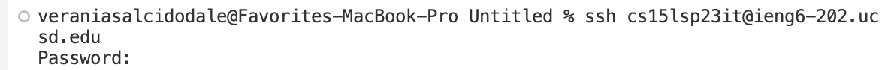

# Lab Report 4
## Log into ieng account

* I typed out my `ssh login` which was < cs15lsp23it@ieng6-202.ucsd.edu > and pressed < enter >

Output:

* The ouput showed some information on when the last time I logged in and basically gave a confirmation that I successfully have logged into my account.

## Clone your fork of the repository from GitHub Account

* To be able to clone the repository from my personal github account I was able to skip out of typing the whole line of code, since it was found in one of the lab tasks. So, I was able to < command -c > and < command -v > to be able to past the desired fork that I wanted to clone. Overall, the commands < command -c > and < command -v > helped me save a lot of time in the long run.

Output:

* The output shows the for actaully being cloned in the terminal, which is a pretty neat sight to see.

## Running the tests, to demonstrate that they fail
The first step that I took before I did some of the commands below:

* The commands that I pressed on my keyboard were: < ls > < enter > < cd lab7 > < enter > < ls > < enter >
* After pressing those commands, I was able to find the commands to run the actual tests to view that they were failing in the lab tasks. Once I found the commands in the lab tasks, I < command -c > and < command -v > to copy and paste both commands one at a time to show that the tests were failing. Also, eventhough I did use a copy and paste method, another way I could've done it was by pressing tab to run and type the command.
* Output:

* The output is showing that there is one failing test in the indicated java file.

## Edit the code file to fix the failing test
* To enter the code to be able to fix it, I entered in the terminal: < vim > < space > < ListExamples.java >
* After I entered those commands, and entered inside the folder where the code was located, I was able to start at the beginning/top of the file and pressed the commands < k > 13 times to get to the exact line where the error was and pressed < l > 7 times to get to the correct character to change `index 1` to `index 2`.
* I also used the command < X > to delete the number 1 in `index 1` and pressed < i > to insert 2 for `index 1` to become `index 2`.
* Output after I fixed the error:
 

## Run the tests now, demonstrating that they now pass

* The image above shows that now that I was able to save and exit vim, using < :wq > , I was then able to test again by pressing the < up arrow > key at least 2 times, which was to run the `javac` command, the < up arrow > again to run the `java` command, and ran both commands from the terminal, I then was able show that the code is now running just fine.

## Commit and Push the resulting change into GitHub Account
* Now that I have fixed my code, I am now able to commit and push the working code into my github account.
* I am able to do the following task by typing out: < git add ListExamples.java > then, < git commit -m 'first commit' > and finally < git push -u origin main >
* These commands helped me commit and push my working code into my github account!!
* Output:

